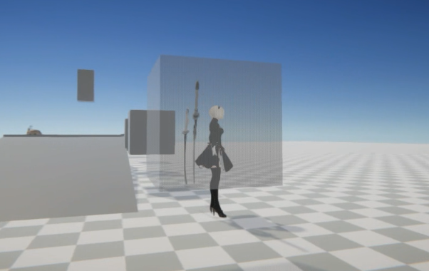
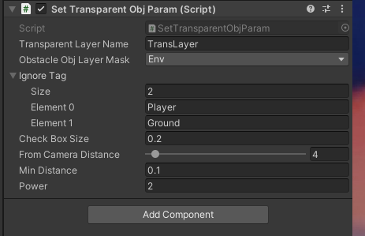
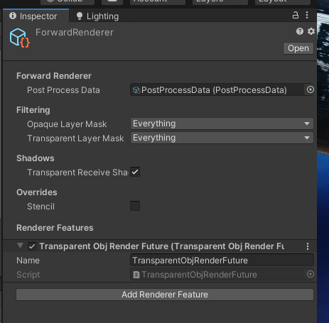
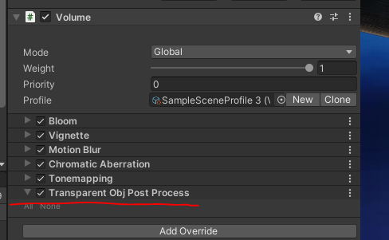

# Transparent-before-camera-Unity
unity version >= 2019.4.17，pipeline urp.

this is post processing like genshin fading objects from camera.

first set post processing volume well. 

then add SetTransparentObjParam script to main camera.

这是一个仿原神实现相机前物体透明的后处理.

首先设置好后处理配置

然后添加SetTransparentObjParam脚本到主相机

